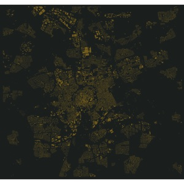
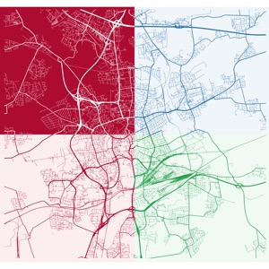

# Plot maps

## Maps

### Braunschweig (DE)

#### BLD

[](braunschweig/bld-01/README.md)
[](braunschweig/bld-02/README.md)

#### RDS

[](braunschweig/rds-01/README.md)
[](braunschweig/rds-02/README.md)
[](braunschweig/rds-03/README.md)
[](braunschweig/rds-04/README.md)
[](braunschweig/rds-05/README.md)
[](braunschweig/rds-06/README.md)
[](braunschweig/rds-07/README.md)

#### ROL

[](braunschweig/rol-01/README.md)

#### RLB

[](braunschweig/rlb-01/README.md)
[](braunschweig/rlb-02/README.md)
[](braunschweig/rlb-03/README.md)
[](braunschweig/rlb-04/README.md)
[](braunschweig/rlb-05/README.md)
[](braunschweig/rlb-06/README.md)

#### CMP

[](braunschweig/cmp-01/README.md)
[](braunschweig/cmp-02/README.md)
[](braunschweig/cmp-03/README.md)
[](braunschweig/cmp-04/README.md)

### Trieste (IT)

#### RDS

[](trieste/rds-01/README.md)

#### RLB

[](trieste/rlb-01/README.md)
[](trieste/rlb-02/README.md)

## Nomenclature

- `BLD`: buildings
- `CMP`: composite
- `RDS`: roads
- `RLB`: roads, landscape, buildings
- `ROL`: roads, landscape

## Create thumbnails

```sh
for IMAGE in $(find . -type f -name "*_full.png"); do
  FILE=$(echo "$IMAGE" | sed 's/_full.png//g')
  sips -s format jpeg $IMAGE --out ${FILE}_thumbnail.jpg --resampleHeight 300 -s formatOptions 80
  sips -s format jpeg $IMAGE --out ${FILE}_large.jpg --resampleWidth 1000 -s formatOptions 80
done
```
