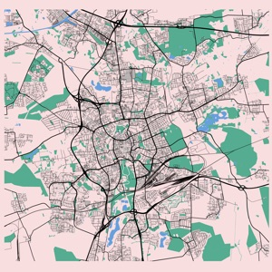

# Plot maps

## Maps

### Braunschweig

[](braunschweig/rlb-01)

## Create thumbnails

```sh
for IMAGE in $(find . -type f -name "*_full.png"); do
  FILE=$(echo "$IMAGE" | sed 's/_full.png//g')
  sips -s format jpeg $IMAGE --out ${FILE}_thumbnail.jpg --resampleHeight 400 -s formatOptions 80
  sips -s format jpeg $IMAGE --out ${FILE}_large.jpg --resampleWidth 1000 -s formatOptions 80
done
```
