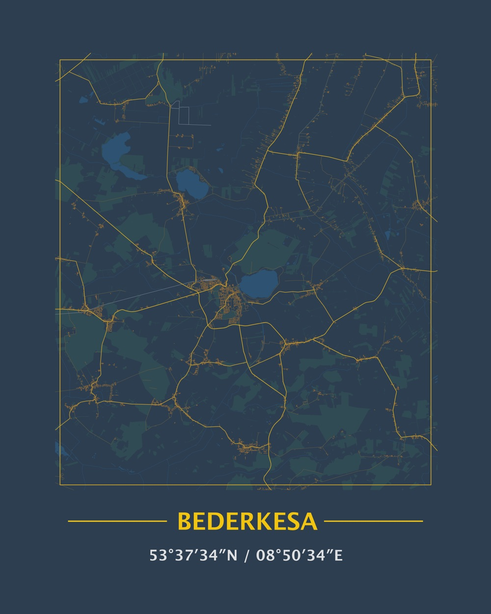

## Result



## Code

Load packages.

```{r eval=FALSE}
library(glue)
library(sf)
library(foreign)
library(tidyverse)
library(lwgeom)
library(stringi)
options(stringsAsFactors = FALSE)
```

Cut geographical map of Niedersachsen to the area of Braunschweig.
Cutting a smaller box and adjusting the part of the map we want is a lot faster than cutting it from the entire Niedersachsen map.

```{r eval=FALSE}
bbox_coordinates <- st_bbox(c(
  xmin = 8.716621,
  ymin = 53.543164,
  xmax = 8.984070,
  ymax = 53.724342
))
```


Load `.shp` files for region, crop to the area we want to plot, and store the cropped data for quicker access later.

Skip this step if the data already exists and load it instead.

```{r eval=FALSE}
if ( !file.exists('bbox.rds') ) {
  bbox_data <- list(
    coordinates = bbox_coordinates,
    buildings_a = read_sf('niedersachsen-latest-free/gis_osm_buildings_a_free_1.shp') %>% st_crop(bbox_coordinates),
    landuse_a = read_sf('niedersachsen-latest-free/gis_osm_landuse_a_free_1.shp') %>% st_crop(bbox_coordinates),
    railways = read_sf('niedersachsen-latest-free/gis_osm_railways_free_1.shp') %>% st_crop(bbox_coordinates),
    roads = read_sf('niedersachsen-latest-free/gis_osm_roads_free_1.shp') %>% st_crop(bbox_coordinates),
    water_a = read_sf('niedersachsen-latest-free/gis_osm_water_a_free_1.shp') %>% st_crop(bbox_coordinates),
    waterways = read_sf('niedersachsen-latest-free/gis_osm_waterways_free_1.shp') %>% st_crop(bbox_coordinates)
  )
  saveRDS(bbox_data, 'bbox.rds')
} else {
  bbox_data <- readRDS('bbox.rds')
}
```

Define recurring theme parameters.

```{r eval=FALSE}
blankbg <- theme(
  axis.line = element_blank(),
  axis.text.x = element_blank(),
  axis.text.y = element_blank(),
  axis.ticks = element_blank(),
  axis.title.x = element_blank(),
  axis.title.y = element_blank(),
  panel.background = element_blank(),
  panel.border = element_blank(),
  panel.grid.major = element_blank(),
  panel.grid.minor = element_blank(),
  plot.background = element_blank()
)
```

Define which elements we want to be plotted in the different categories.

```{r eval=FALSE}
green_elements <- c('forest')
water_bodies <- c('water')
rivers <- c('river','canal','stream')
roads_small <- c('cycleway','footway','living_street','residential','service','unclassified')
roads_tertiary <- c('tertiary','tertiary_link')
roads_secondary <- c('secondary','secondary_link')
roads_primary <- c('primary','primary_link','motorway','motorway_link','trunk','trunk_link')
```

Assign colors to different element categories.

```{r eval=FALSE}
color_forest <- '#304b53'
color_water <- '#2d5272'
color_roads <- '#d9ac25'
```

Plot map.

```{r eval=FALSE}
p <-
  ggplot() +
  geom_sf(data = bbox_data$landuse_a %>% filter(fclass %in% green_elements),
          size = 0, color = NA, fill = color_forest) +
  geom_sf(data = bbox_data$waterways %>% dplyr::filter(fclass %in% rivers),
          size = 0.2, color = color_water, fill = NA) +
  geom_sf(data = bbox_data$roads %>% dplyr::filter(fclass %in% roads_small),
          size = 0.2, color = '#6d5f43', fill = NA) +
  geom_sf(data = bbox_data$railways, size = 0.2, color = '#87929d', fill = NA) +
  geom_sf(data = bbox_data$buildings_a, size = 0.05, color = '#cb862b',
          fill = '#7c5c3f') +
  geom_sf(data = bbox_data$water_a %>% dplyr::filter(fclass %in% water_bodies),
          size = 0, color = NA, fill = color_water) +
  geom_sf(data = bbox_data$roads %>% dplyr::filter(fclass %in% roads_tertiary),
          size = 0.4, color = '#c39c30', fill = NA) +
  geom_sf(data = bbox_data$roads %>% dplyr::filter(fclass %in% roads_secondary),
          size = 0.4, color = color_roads, fill = NA) +
  geom_sf(data = bbox_data$roads %>% dplyr::filter(fclass %in% roads_primary),
          size = 0.4, color = color_roads, fill = NA) +
  blankbg +
  theme(plot.background = element_rect(fill = '#2c3e50', color = NA)) +
  coord_sf(
    xlim = bbox_data$coordinates[c(1,3)],
    ylim = bbox_data$coordinates[c(2,4)],
    expand = FALSE
  )
```

Save map as PNG and PDF.

```{r eval=FALSE}
ggsave('map_full.png', p, scale = 1, width = 20, height = 20, units = 'cm',
       dpi = 250)
ggsave('map_full.pdf', p, scale = 1, width = 20, height = 20, units = 'cm')
```

## Final touches

The final image was made manually using a vector graphics editor.

## Resources

- [Map of Niedersachsen](http://download.geofabrik.de/europe/germany/niedersachsen.html) was downloaded from [Geofabrik](https://www.geofabrik.de)
