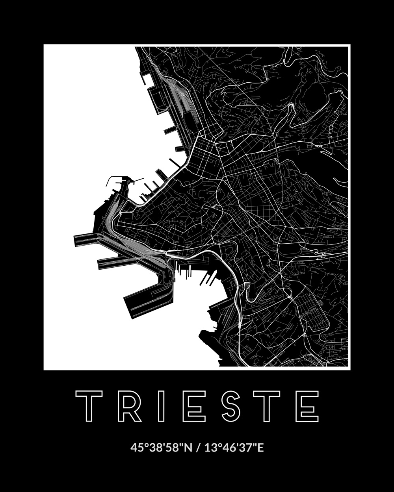

## Result



## Code

Load packages.

```{r eval=FALSE}
library(glue)
library(sf)
library(foreign)
library(tidyverse)
library(lwgeom)
library(stringi)
options(stringsAsFactors = FALSE)
```

Define box of map that we want to plot.

```{r eval=FALSE}
bbox_coordinates <- st_bbox(c(
  xmin = 13.738060,
  ymin = 45.620521,
  xmax = 13.804836,
  ymax = 45.670204
))
```

Load `.shp` files for region and country boundaries, crop to the area we want to plot, and store the cropped data for quicker access later.

Skip this step if the data already exists and load it instead..

```{r eval=FALSE}
if ( !file.exists('bbox.rds') ) {
  bbox_data <- list(
    coordinates = bbox_coordinates,
    railways = read_sf('gis_osm_railways_free_1.shp') %>% st_crop(bbox_coordinates),
    roads = read_sf('gis_osm_roads_free_1.shp') %>% st_crop(bbox_coordinates),
    country_boundaries = read_sf('country_boundaries/Italy_AL2.shp') %>% st_crop(bbox_coordinates)
  )
  saveRDS(bbox_data, 'bbox.rds')
} else {
  bbox_data <- readRDS('bbox.rds')
}
```

Define recurring theme parameters.

```{r eval=FALSE}
blankbg <- theme(
  axis.line = element_blank(),
  axis.text.x = element_blank(),
  axis.text.y = element_blank(),
  axis.ticks = element_blank(),
  axis.title.x = element_blank(),
  axis.title.y = element_blank(),
  panel.background = element_blank(),
  panel.border = element_blank(),
  panel.grid.major = element_blank(),
  panel.grid.minor = element_blank(),
  plot.background = element_blank()
)
```

Define which elements we want to be plotted in the different categories.

```{r eval=FALSE}
railways <- c('rail','subway')
roads_small <- c('unclassified','service','residential')
roads_tertiary <- c('tertiary','tertiary_link')
roads_secondary <- c('secondary','secondary_link')
roads_primary <- c('primary','primary_link','motorway','motorway_link','trunk','trunk_link')
```

Assign colors to different element categories.

```{r eval=FALSE}
color_borders <- 'black'
color_roads <- 'white'
color_background <- 'white'
```

Plot map.

```{r eval=FALSE}
p <-
  ggplot() +
  geom_sf(data = bbox_data$country_boundaries,
          size = 0.35, color = color_borders, fill = color_borders) +
  geom_sf(data = bbox_data$roads %>% dplyr::filter(fclass %in% roads_small),
          size = 0.15, color = color_roads, fill = NA) +
  geom_sf(data = bbox_data$railways %>% dplyr::filter(fclass %in% railways),
          size = 0.15, color = color_roads, fill = NA) +
  geom_sf(data = bbox_data$roads %>% dplyr::filter(fclass %in% roads_tertiary),
          size = 0.4, color = color_roads, fill = NA) +
  geom_sf(data = bbox_data$roads %>% dplyr::filter(fclass %in% roads_secondary),
          size = 0.5, color = color_roads, fill = NA) +
  geom_sf(data = bbox_data$roads %>% dplyr::filter(fclass %in% roads_primary),
          size = 0.6, color = color_roads, fill = NA) +
  blankbg +
  theme(plot.background = element_rect(fill = color_background, color = NA)) +
  coord_sf(xlim = bbox_data$coordinates[c(1,3)],
           ylim = bbox_data$coordinates[c(2,4)],
           expand = FALSE)
```

Save map as PNG and PDF.

```{r eval=FALSE}
ggsave(
  'map_full.png',
  p, scale = 1, width = 20, height = 20, units = 'cm', dpi = 250
)
ggsave(
  'map_full.pdf',
  p, scale = 1, width = 20, height = 20, units = 'cm'
)
```

## Final touches

The final image was made manually using a vector graphics editor.

## Resources

- [Map of North-East Italy](http://download.geofabrik.de/europe/italy/nord-est.html) was downloaded from [Geofabrik](https://www.geofabrik.de)
- [Country borders](https://osm-boundaries.com)
