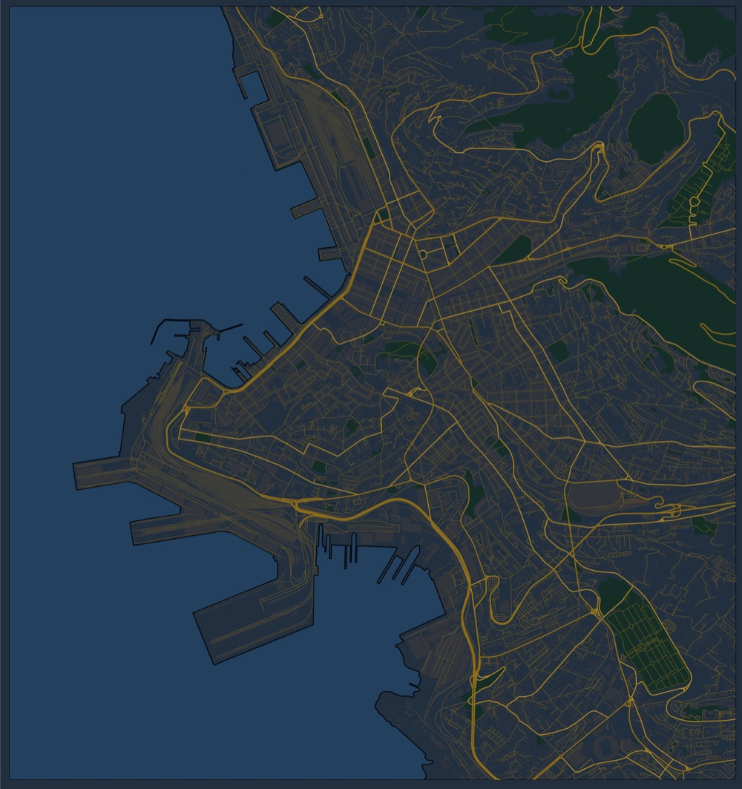

## Result



## Code

Load packages.

```{r eval=FALSE}
library(sf)
library(foreign)
library(tidyverse)
library(lwgeom)
library(stringi)
options(stringsAsFactors = FALSE)
```

Define box of map that we want to plot.

```{r eval=FALSE}
bbox_coordinates <- st_bbox(c(
  xmin = 13.738060,
  ymin = 45.620521,
  xmax = 13.804836,
  ymax = 45.670204
))
```

Load `.shp` files for region and country boundaries, crop to the area we want to plot, and store the cropped data for quicker access later.

We need the country boundaries once with the border along the land area and once inside the water because the sea is not annotated in any of the other `.shp` files and if we draw the background blue, there will also be a blue border around the whole map.
This trick is only possible because we have zoomed into the map far enough that all the parts of the sea seen in it still belong to Italy and therefore, when downloading the border of Italy including the water, we can use that to draw the sea and then the land on top.

Skip this step if the data already exists and load it instead.

```{r eval=FALSE}
if ( !file.exists('bbox.rds') ) {
  bbox_data <- list(
    coordinates = bbox_coordinates,
    buildings_a = read_sf('gis_osm_buildings_a_free_1.shp') %>% st_crop(bbox_coordinates),
    landuse_a = read_sf('gis_osm_landuse_a_free_1.shp') %>% st_crop(bbox_coordinates),
    railways = read_sf('gis_osm_railways_free_1.shp') %>% st_crop(bbox_coordinates),
    roads = read_sf('gis_osm_roads_free_1.shp') %>% st_crop(bbox_coordinates),
    water_a = read_sf('gis_osm_water_a_free_1.shp') %>% st_crop(bbox_coordinates),
    country_boundaries = read_sf('country_boundaries/Italy_AL2.shp') %>% st_crop(bbox_coordinates),
    country_boundaries_with_water = read_sf('country_boundaries_with_water/Italy_AL2.shp') %>% st_crop(bbox_coordinates)
  )
  saveRDS(bbox_data, 'bbox.rds')
} else {
  bbox_data <- readRDS('bbox.rds')
}
```

Define recurring theme parameters.

```{r eval=FALSE}
blankbg <- theme(
  axis.line = element_blank(),
  axis.text.x = element_blank(),
  axis.text.y = element_blank(),
  axis.ticks = element_blank(),
  axis.title.x = element_blank(),
  axis.title.y = element_blank(),
  panel.background = element_blank(),
  panel.border = element_blank(),
  panel.grid.major = element_blank(),
  panel.grid.minor = element_blank(),
  plot.background = element_blank(),
)
```

Define which elements we want to be plotted in the different categories.

```{r eval=FALSE}
water_bodies <- c('water')
green_elements <- c('grass','cemetery','forest','park')
railways <- c('rail','subway')
roads_small <- c('unclassified','service','residential')
roads_tertiary <- c('tertiary','tertiary_link')
roads_secondary <- c('secondary','secondary_link')
roads_primary <- c('primary','primary_link','motorway','motorway_link','trunk','trunk_link')
```

Assign colors to different element categories.

```{r eval=FALSE}
color_borders <- 'black'
color_roads <- '#6d5f43'
color_roads_tertiary <- '#c39c30'
color_roads_secondary <- '#d9ac25'
color_roads_primary <- '#d9ac25'
color_background <- '#2c3e50'
color_green <- '#183b32'
color_water <- '#2d5272'
color_buildings_border <- '#cb862b'
color_buildings_fill <- '#7c5c3f'
```

Plot map.

```{r eval=FALSE}
p <-
  ggplot() +
  geom_sf(data = bbox_data$country_boundaries_with_water,
          color = color_borders, size = 0.35, fill = color_water) +
  geom_sf(data = bbox_data$country_boundaries,
          color = color_borders, size = 0.35, fill = color_background) +
  geom_sf(data = bbox_data$water_a %>% dplyr::filter(fclass %in% water_bodies),
          size = 0, fill = color_water) +
  geom_sf(data = bbox_data$landuse_a %>% filter(fclass %in% green_elements),
          size = 0, fill = color_green) +
  geom_sf(data = bbox_data$roads %>% dplyr::filter(fclass %in% roads_small),
          color = color_roads, size = 0.15) +
  geom_sf(data = bbox_data$railways, size = 0.15, color = color_roads) +
  geom_sf(data = bbox_data$roads %>% dplyr::filter(fclass %in% roads_tertiary),
          color = color_roads_tertiary, size = 0.4) +
  geom_sf(data = bbox_data$roads %>% dplyr::filter(fclass %in% roads_secondary),
          color = color_roads_secondary, size = 0.5) +
  geom_sf(data = bbox_data$roads %>% dplyr::filter(fclass %in% roads_primary),
          color = color_roads_primary, size = 0.6) +
  geom_sf(data = bbox_data$buildings_a, color = color_buildings_border,
          alpha = 0.25, size = 0.05, fill = color_buildings_fill) +
  blankbg +
  theme(plot.background = element_rect(fill = color_background, color = NA)) +
  coord_sf(xlim = bbox_data$coordinates[c(1,3)],
           ylim = bbox_data$coordinates[c(2,4)],
           expand = FALSE)
```

Save map as PNG.

```{r eval=FALSE}
ggsave('map_full.png', p, scale = 1, width = 20, height = 20, units = 'cm',
       dpi = 250)
```

## Resources

- [Map of North-East Italy](http://download.geofabrik.de/europe/italy/nord-est.html) was downloaded from [Geofabrik](https://www.geofabrik.de)
- [Country borders](https://osm-boundaries.com)
