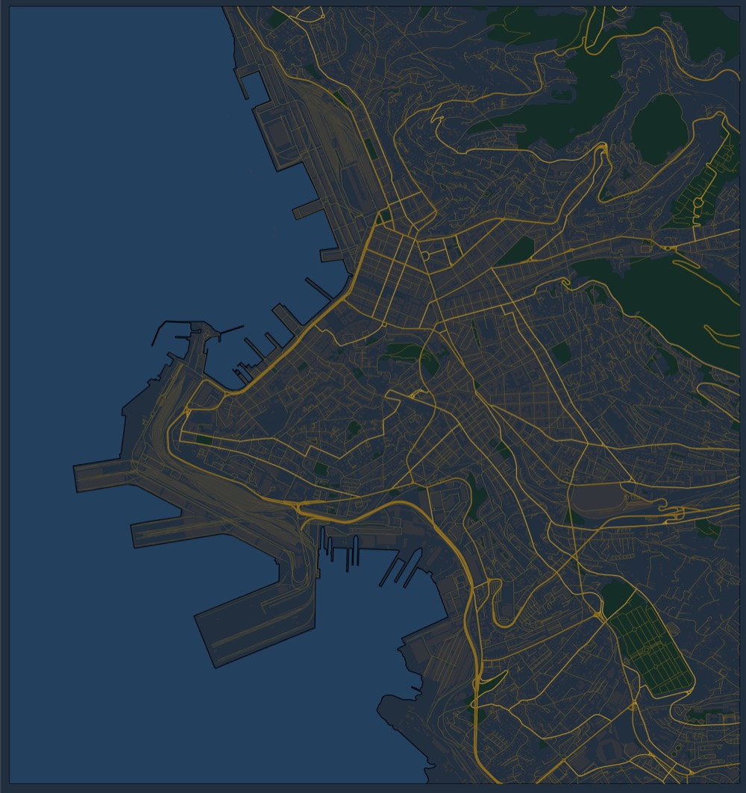

Trieste - RLB-02
================

## Result



## Code

Load packages.

``` r
library(sf)
library(foreign)
library(tidyverse)
library(lwgeom)
library(stringi)
options(stringsAsFactors = FALSE)
```

Define box of map that we want to plot.

``` r
bbox_coordinates <- st_bbox(c(
  xmin = 13.738060,
  ymin = 45.620521,
  xmax = 13.804836,
  ymax = 45.670204
))
```

Load `.shp` files for region and country boundaries, crop to the area we
want to plot, and store the cropped data for quicker access later.

We need the country boundaries once with the border along the land area
and once inside the water because the sea is not annotated in any of the
other `.shp` files and if we draw the background blue, there will also
be a blue border around the whole map. This trick is only possible
because we have zoomed into the map far enough that all the parts of the
sea seen in it still belong to Italy and therefore, when downloading the
border of Italy including the water, we can use that to draw the sea and
then the land on top.

Skip this step if the data already exists and load it instead.

``` r
if ( !file.exists('bbox.rds') ) {
  bbox_data <- list(
    coordinates = bbox_coordinates,
    buildings_a = read_sf('gis_osm_buildings_a_free_1.shp') %>% st_crop(bbox_coordinates),
    landuse_a = read_sf('gis_osm_landuse_a_free_1.shp') %>% st_crop(bbox_coordinates),
    railways = read_sf('gis_osm_railways_free_1.shp') %>% st_crop(bbox_coordinates),
    roads = read_sf('gis_osm_roads_free_1.shp') %>% st_crop(bbox_coordinates),
    water_a = read_sf('gis_osm_water_a_free_1.shp') %>% st_crop(bbox_coordinates),
    country_boundaries = read_sf('country_boundaries/Italy_AL2.shp') %>% st_crop(bbox_coordinates),
    country_boundaries_with_water = read_sf('country_boundaries_with_water/Italy_AL2.shp') %>% st_crop(bbox_coordinates)
  )
  saveRDS(bbox_data, 'bbox.rds')
} else {
  bbox_data <- readRDS('bbox.rds')
}
```

Define recurring theme parameters.

``` r
blankbg <- theme(
  axis.line = element_blank(),
  axis.text.x = element_blank(),
  axis.text.y = element_blank(),
  axis.ticks = element_blank(),
  axis.title.x = element_blank(),
  axis.title.y = element_blank(),
  panel.background = element_blank(),
  panel.border = element_blank(),
  panel.grid.major = element_blank(),
  panel.grid.minor = element_blank(),
  plot.background = element_blank(),
)
```

Define which elements we want to be plotted in the different categories.

``` r
water_bodies <- c('water')
green_elements <- c('grass','cemetery','forest','park')
railways <- c('rail','subway')
roads_small <- c('unclassified','service','residential')
roads_tertiary <- c('tertiary','tertiary_link')
roads_secondary <- c('secondary','secondary_link')
roads_primary <- c('primary','primary_link','motorway','motorway_link','trunk','trunk_link')
```

Assign colors to different element categories.

``` r
color_borders <- 'black'
color_roads <- '#6d5f43'
color_roads_tertiary <- '#c39c30'
color_roads_secondary <- '#d9ac25'
color_roads_primary <- '#d9ac25'
color_background <- '#2c3e50'
color_green <- '#183b32'
color_water <- '#2d5272'
color_buildings_border <- '#cb862b'
color_buildings_fill <- '#7c5c3f'
```

Plot map.

``` r
p <-
  ggplot() +
  geom_sf(data = bbox_data$country_boundaries_with_water,
          color = color_borders, size = 0.35, fill = color_water) +
  geom_sf(data = bbox_data$country_boundaries,
          color = color_borders, size = 0.35, fill = color_background) +
  geom_sf(data = bbox_data$water_a %>% dplyr::filter(fclass %in% water_bodies),
          size = 0, fill = color_water) +
  geom_sf(data = bbox_data$landuse_a %>% filter(fclass %in% green_elements),
          size = 0, fill = color_green) +
  geom_sf(data = bbox_data$roads %>% dplyr::filter(fclass %in% roads_small),
          color = color_roads, size = 0.15) +
  geom_sf(data = bbox_data$railways, size = 0.15, color = color_roads) +
  geom_sf(data = bbox_data$roads %>% dplyr::filter(fclass %in% roads_tertiary),
          color = color_roads_tertiary, size = 0.4) +
  geom_sf(data = bbox_data$roads %>% dplyr::filter(fclass %in% roads_secondary),
          color = color_roads_secondary, size = 0.5) +
  geom_sf(data = bbox_data$roads %>% dplyr::filter(fclass %in% roads_primary),
          color = color_roads_primary, size = 0.6) +
  geom_sf(data = bbox_data$buildings_a, color = color_buildings_border,
          alpha = 0.25, size = 0.05, fill = color_buildings_fill) +
  blankbg +
  theme(plot.background = element_rect(fill = color_background, color = NA)) +
  coord_sf(xlim = bbox_data$coordinates[c(1,3)],
           ylim = bbox_data$coordinates[c(2,4)],
           expand = FALSE)
```

Save map as PNG.

``` r
ggsave('map_full.png', p, scale = 1, width = 20, height = 20, units = 'cm',
       dpi = 250)
```

## Resources

-   [Map of North-East
    Italy](http://download.geofabrik.de/europe/italy/nord-est.html) was
    downloaded from [Geofabrik](https://www.geofabrik.de)
-   [Country borders](https://osm-boundaries.com)
